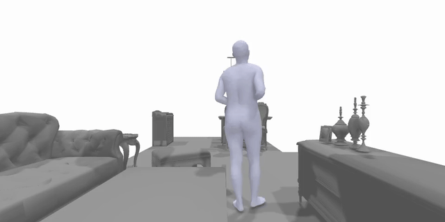
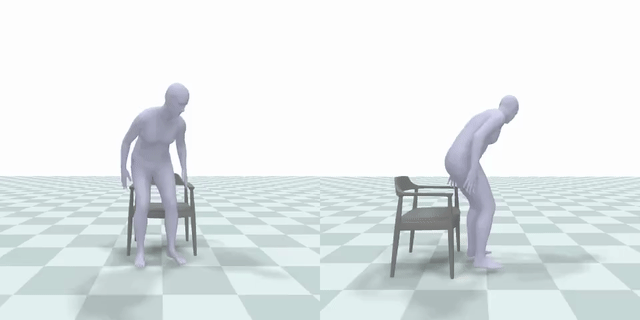

# Generating Human Interaction Motions in Scenes with Text Control

## Description 
This is the official PyTorch implementation of the paper "Generating Human Interaction Motions in Scenes
with Text Control" (ECCV2024). For more details, please visit our [project webpage](https://research.nvidia.com/labs/toronto-ai/tesmo/)

## bibtex
if you find the code useful, kindly cite our work:

```
@inproceedings{yi2024tesmo,
    author={Yi, Hongwei and Thies, Justus and Black, Michael J. and Peng, Xue Bin and Rempe, Davis},
    title={Generating Human Interaction Motions in Scenes with Text Control},
    booktitle = {ECCV},
    year={2024}
}  
```


## Getting started

This code was tested on `Ubuntu 20.04.5 LTS` and requires:

* Python 3.8
* conda3 or miniconda3
* CUDA capable GPU (one is enough)

### 1. Setup environment 

Install ffmpeg (if not already installed):

```shell
sudo apt update
sudo apt install ffmpeg
```

Setup conda env:

```shell
conda env create -f environment.yml
conda activate tesmo
python -m spacy download en_core_web_sm
pip install git+https://github.com/openai/CLIP.git
pip install git+https://github.com/GuyTevet/smplx.git
pip install wanbd
pip install "git+https://github.com/facebookresearch/pytorch3d.git"
pip install human-body-prior # this will leads to bm_name error
pip install moviepy
pip install hydra
git clone https://github.com/nghorbani/human_body_prior.git
python setup.py install
pip install python-fcl
# install mmcv
pip install mmcv==2.0.0rc4 -f https://download.openmmlab.com/mmcv/dist/cu117/torch1.13/index.html
# visualization
pip install torchshow
pip install matplotlib==3.1.3
# pip install mesh-to-sdf
pip install git+https://github.com/marian42/mesh_to_sdf.git
pip install open3d
pip install plyfile
pip install numpy==1.23.4
```

### 2. Get PriorMDM dependencies

PriorMDM share most of its dependencies with the original MDM. Please follow the [official instructions](https://github.com/priorMDM/priorMDM?tab=readme-ov-file#getting-started) to install the dependencies.


</details>


### 3. Download the pretrained models

Download the pretrained models from **[interaction model](https://www.dropbox.com/scl/fo/1r7kpf6glmu92g77bdse4/ACjns4KBFFtDiSgH6yFKWL4?rlkey=e49ar7qm5jqgb5txhsku58mm0&st=6uutl92g&dl=0)** and **[locomotion model](https://www.dropbox.com/scl/fo/srl6hyuon5j40omv8p8ok/AJh6wmIScthloNK5R-gQRm0?rlkey=qygk6ya0gxhypnrhn3uv58umx&st=goi99lbo&dl=0)**, then unzip and place it in `pretrained_model/`.


### 4. Dataset setup
#### Loco-3D-Front
- Follow the insturctions in [data_generation](/data_generation/README.md) to get the bird-view floor plan and object mask from [3D-FRONT](https://tianchi.aliyun.com/specials/promotion/alibaba-3d-scene-dataset). 
Then, align human motions with 3D scenes by runing [align_motion_amass](/data_generation/locomotion/align_motion_amass.py). All the fitting results will be saved to `dataset/3dfront_fitting` folder.
- Finally, run this command to get canonical motion-scene pairs for training and inference:
    ```bash
    bash scripts/preprocess_locomotion.sh
    ```
    The results will be saved to `dataset/3dfront_fitting`.

#### Human-Object Interaction
- Follow the insturctions in [data_generation](/data_generation/README.md) to fit objects to human motions.
Then, place the fitting results under `dataset/SAMP_interaction/SAMP_objects` folder.
- Download the 3D-FUTURE dataset from this [webpage](https://tianchi.aliyun.com/specials/promotion/alibaba-3d-scene-dataset), then place the downloaded dataset under `dataset/3D-FUTURE-model` folder 
- Download the original SAMP dataset from this [webpage](https://samp.is.tue.mpg.de/), then place it under `dataset/SAMP_interaction/body_meshes_smpl` folder.


### Inference 

#### Locomotion
Before running human locomotion generation, please download pretrained `root_horizontal_control` model from [PriorMDM](https://github.com/priorMDM/priorMDM.git), and put it under folder `pretrained_model/inpainting`.

To run locomotion inference on HumanML3D, you can run this command:
```bash
bash run_sh/run_infer_locomotion.sh
```

To render generated human motion in 3D scene, you can run this command:
```bash
bash run_sh/run_render_locomotion.sh [samplie_id] # sample_id: 0, 1, 2 ...
```
Finally, you can get the visualization result like this:




#### Interaction
To evaluate a pretrained interaction model on SAMP, you can run this command to start inference:
```bash
bash run_sh/run_infer_interaction.sh
```
* Use `--joint2mesh` to run SMPLify.
* Use `--render_pyrender` to visualize human-object interaction.

Finally, you can get the visualization results like this:



## License
This codebase and pre-trained models are provided under [this non-commercial license](./LICENSE). As detailed below, parts of the code build on prior work with their own licenses.

## Acknowledgments

Our implementation takes advantage of several great prior works that have their [own licenses](./licenses/LICENSES_3RD_PARTY) that must be followed:
* Some code is from [PriorMDM](https://github.com/priorMDM/priorMDM)
* We took reference from [OmniControl](https://github.com/neu-vi/OmniControl)
* We borrow some data generation code from [SUMMON](https://github.com/onestarYX/summon)
* Data processing code from [HUMANISE](https://github.com/Silverster98/HUMANISE/tree/main)

We thanks these authors for their open source contributions. 

Our models are trained on data that makes use of [3D-FRONT](./licenses/3D-FRONT.pdf) and [3D-FUTURE](./licenses/3D-FUTURE.pdf) datasets.

Thanks Yangyi Huang, Yifei Liu and Xiaolin Hong for technical support.
Thanks Mathis Petrovich and Nikos Athanasiou for the fruitful discussion about text-to-motion synthesis.
Thanks T. Niewiadomski, T. McConnell, and T. Alexiadis for running the user study.

