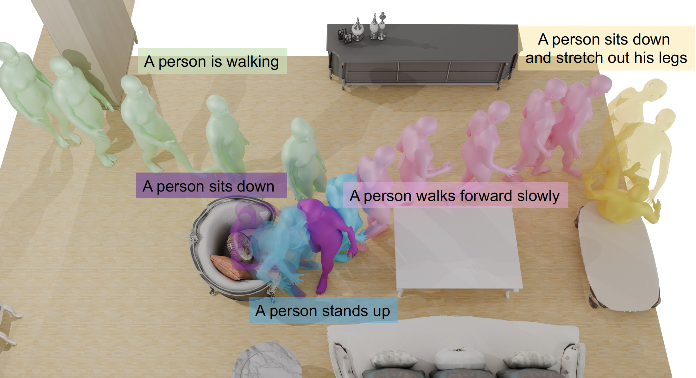

# TeSMo: Generating Human Interaction Motions in Scenes with Text Control
### Hongwei Yi, Justus Thies, Michael J. Black, Xue Bin Peng, Davis Rempe

<div float="center">
    
</div>

This is the official implementation of TeSMo, a method for text-controlled scene-aware motion generation, from the ECCV 2024 paper: "Generating Human Interaction Motions in Scenes with Text Control".

[[Paper]](https://arxiv.org/pdf/2404.10685) [[Website]](https://research.nvidia.com/labs/toronto-ai/tesmo/) [[Video]](https://www.youtube.com/watch?v=_3e5LRh9jVc)

## Downloads
### Datasets
Our locomotion dataset is built from 3D-Front and HumanML3D, while our interaction data depends on SAMP. You will need to download these datasets first in order to build our datasets.

## Data Processing
Run these scripts to process the datasets.


## Citation
If you find this work useful for your research, please cite our paper:
```
@inproceedings{yi2024tesmo,
    author={Yi, Hongwei and Thies, Justus and Black, Michael J. and Peng, Xue Bin and Rempe, Davis},
    title={Generating Human Interaction Motions in Scenes with Text Control},
    booktitle={European Conference on Computer Vision (ECCV)},
    year={2024}
}            
```